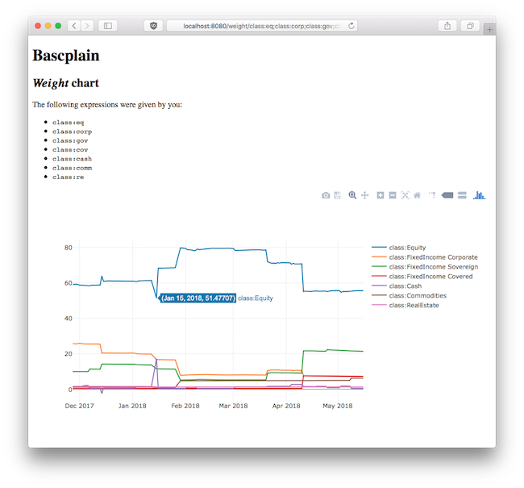

# bascplain

*bascplain* (Baader Bank/Scalable Capital explain) is an F# analysis tool for the Scalable Capital robo-advisor using the Baader Bank costumer reporting files.

## Current state



The calculations seem to work with my personal CSV files.

The Suave web server is already integrated into the F# project and serves some Plotly charts. The UI is not really user-friendly though; this is the next step.

## What it is supposed to do

Although Scalable Capital offers a performance chart, no data about the history of the asset allocation is available on their site.
So the main aim of this tool is to show the weights of the individual asset classes and regions over time. This is possible through the CSV files provided on their broker's web interface, provided you use Baader Bank as their broker.

Other possible interesting features could be:

- Performance comparison between buy-and-hold and/or fixed asset allocations and the dynamic risk management of the robo-advisor
- Retrospective risk measures (maximum drawdown, volatility, sample VaR) comparison
- VaR exceedance test, once the time series is long enough (one could use the square-root rule to approximate the daily VaR but this would probably contradict the underlying risk model)
- Compare the paid fees to a risk-adjusted return

## How to use

You will need .NET Core not older than 2.1.104. Of course, you will need the broker CSV files in a directory. Once checked out switch to the repository directory and run

```bash
$ dotnet run
Enter CSV directory: /enter/path/to/csv/files/here
[04:20:00 INF] Smooth! Suave listener started in 79.511ms with binding 127.0.0.1:8080
```

You can also pass the directory as argument like `dotnet run "/path/to/csvs"`.

Then visit <http://localhost:8080/> in your browser.

## Technology

- F# on .NET Core 2
- CSV type providers are used for CSV reading
- Suave will serve web pages
